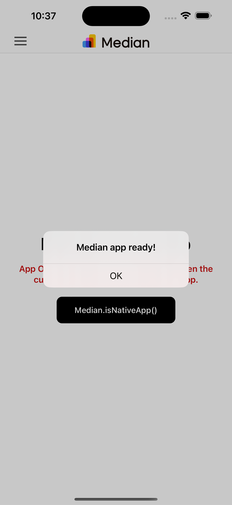

## Getting Started

To run the app in development mode, use the following command:

`npm start`
or
`yarn start`

This will open http://localhost:3000 in your browser. You can close this browser window and proceed to test within your Median app.

## Usage

### Local iOS Simulator

- Create an app on https://median.co/app with `http://localhost:3000` as the initial URL and download the source code or temporarily change the `initialUrl` in the local appConfig.json file if you already have your app's source code available.
- Build and run the app via Xcode on the iOS simulator.

### Local Android Emulator

- Create an app on https://median.co/app with `http://localhost:3000` as the initial URL and download the source code or temporarily change the `initialUrl` in the local appConfig.json file if you already have your app's source code available.
- In your terminal run `adb reverse tcp:3000 tcp:3000` to enable port forwarding to your emulator.
- Build and run the app via Android Studio.

### Physical Devices

To run the app on physical devices you need the IP address of your computer on your local network. 
- Replace the `http://localhost:3000` with `http://<your-ip-address>:3000` in appConfig.json.
- Make sure both your computer and your mobile device are on the same local network i.e. Wi-Fi.
- Build and run the app using the respective IDE for Android or iOS.

### Successful launch
The React app will display an alert immediately upon page load when launched within a Median app.

